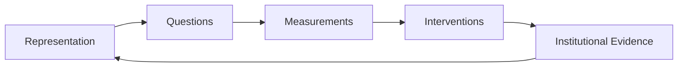

# Frozen Representations
## Institutional ontology lock-in as a research hypothesis

A further extension of the Information Asymmetry programme concerns **representational freezing**: the possibility that a representation remains embedded in an institution after the task, environment, or system has changed enough that the representation is no longer causally sufficient.

The claim here is deliberately provisional. The scientific claim established elsewhere in this repository is about **task-relative causal sufficiency**. The institutional claim introduced here is a separate research hypothesis about what may happen when representations become stabilised by curricula, methods, standards, incentives, professional identity, governance processes, or organisational routines.

> **Ontology is a tool, not a commitment.**
>
> **You keep a representation only as long as it delivers the causal performance the task actually requires. When it falls short, you perturb it, expand it, hybridise it, or discard it.**

## The core failure mode

An institution can continue to receive new evidence while interpreting that evidence through an unchanged representational frame.

```text
new evidence
    ↓
old representation
    ↓
distorted or incomplete interpretation
```

The alternative is to make the representation itself part of what is tested:

```text
new evidence
    ↓
representation stress-test
    ↓
retain / perturb / expand / hybridise / discard
```

The key problem is therefore not merely that institutions can be slow. It is that they can **freeze a representation and mistake persistence for validity**.

## Frozen-representation cascade

A provisional cascade is:

\[
\text{Frozen representation}
\rightarrow
\text{Frozen questions}
\rightarrow
\text{Frozen measurements}
\rightarrow
\text{Frozen interventions}
\rightarrow
\text{Recurring failure}
\]

The mechanism is straightforward. If a representation determines which variables are considered important, it also constrains which questions are asked. Those questions constrain what gets measured. Measurements constrain what interventions appear available. If the original representation has become causally insufficient, the resulting intervention space may inherit the same blind spots.

## Scientific claim versus institutional hypothesis

These should not be collapsed.

### Scientific claim

A representation can be causally sufficient for one task and insufficient for another.

A representation ceases to be sufficient when the task requires information that the representation has compressed away.

### Institutional hypothesis

Institutions may continue using a historically useful representation after it becomes insufficient for a changed task or system because the representation is embedded in:

- curricula;
- disciplinary boundaries;
- professional vocabulary;
- evaluation criteria;
- funding structures;
- standards and regulation;
- organisational workflows;
- software and data schemas;
- established methods;
- reputational or career incentives.

This hypothesis requires empirical validation. It should not be treated as a universal claim that institutions resist change or that older representations are necessarily wrong.

## Why this matters for AI

AI systems are changing rapidly in capability and operational form. A model that once primarily generated text may now participate in a system that can call tools, access data, trigger workflows, alter external state, coordinate with other agents, or execute economically significant actions.

If the system changes from:

```text
model → output
```

to:

```text
state → trajectory → tool action → external transition
```

then a representation designed mainly for output description may become insufficient for runtime governance.

That does not make the earlier representation useless. It means the task has changed and the representation must be re-evaluated against the new causal requirements.

This is the same methodological move that produced the current progression in this programme:

\[
\text{Psychological}
\rightarrow
\text{Dynamical}
\rightarrow
\text{Structural Causal / Mechanistic}
\rightarrow
\text{Hybrid}
\]

The transition was not motivated by loyalty to a preferred ontology. It was motivated by observed performance gaps on causal tasks.

## Institutional ontology lock-in

The strongest version of the concern is:

> **When a representation becomes embedded in an institution, preserving the representation can become easier than preserving contact with the changing causal structure of the system being studied.**

This does not require bad intent. Lock-in can emerge because institutions need stable categories to teach, fund, regulate, compare, and coordinate work. Stability has real value.

The risk appears when stability becomes decoupled from causal performance.

A representation can then become operationally self-reinforcing:



If the loop is never perturbed by external performance criteria, the institution can repeatedly confirm the representation using evidence generated inside the representation's own measurement regime.

## A task-relative update rule

The programme therefore proposes a simple methodological update rule:

\[
R_{t+1}=
\begin{cases}
R_t, & \text{if } R_t \text{ remains causally sufficient for task } T \\
\operatorname{Perturb}(R_t), & \text{if local repair is sufficient} \\
\operatorname{Expand}(R_t), & \text{if missing variables are identifiable} \\
\operatorname{Hybridise}(R_t,R'), & \text{if complementary structure is required} \\
R', & \text{if } R_t \text{ is no longer adequate}
\end{cases}
\]

The important point is that **representation change is triggered by task-relative causal performance, not by novelty for its own sake**.

## What would make the hypothesis testable?

A research programme on frozen representations should move beyond anecdote. Candidate tests include:

1. Identify a domain in which the operational task changed materially over time.
2. Identify the dominant representation used before and after the change.
3. Define the causal task the institution needed to perform.
4. Measure whether the historical representation retained the variables needed for that task.
5. Compare it with expanded or hybrid alternatives under controlled representation capacity where possible.
6. Measure whether institutional outputs changed only after the representation changed.
7. Distinguish representational failure from implementation failure, incentive failure, data scarcity, or ordinary organisational delay.

Possible domains include AI governance, cybersecurity, medicine, finance, infrastructure, and other areas where the system under study changes faster than institutional categories.

## Falsification and restraint

The institutional hypothesis should be weakened or rejected where evidence shows that:

- institutions update representations promptly when task demands change;
- the existing representation remains causally sufficient despite environmental change;
- poor outcomes are better explained by execution, incentives, resourcing, or data quality than by representation failure;
- newer or hybrid representations do not improve task-relative causal performance;
- the apparent ontology problem disappears after controlling for implementation quality.

The aim is not to assume ontology failure everywhere. It is to make ontology itself an object of empirical scrutiny.

## Relation to Information Asymmetry

This note extends the central Information Asymmetry principle:

> **A representation is causally sufficient for a task only if it preserves enough task-relevant information to support the required inference, reconstruction, intervention, or accountability judgement.**

The institutional extension asks:

> **What happens when a representation ceases to be sufficient, but the institution using it does not update?**

That question turns representational sufficiency into an organisational and governance problem as well as a scientific one.

## Methodological principle

The purest formulation remains:

> **Ontology is a tool, not a commitment. You keep a representation only as long as it delivers the causal performance the task actually requires. When it falls short, you perturb it, expand it, hybridise it, or discard it.**

The point is not permanent instability. The point is conditional commitment:

**commit to causal performance, not to the representation that happened to deliver it last time.**
