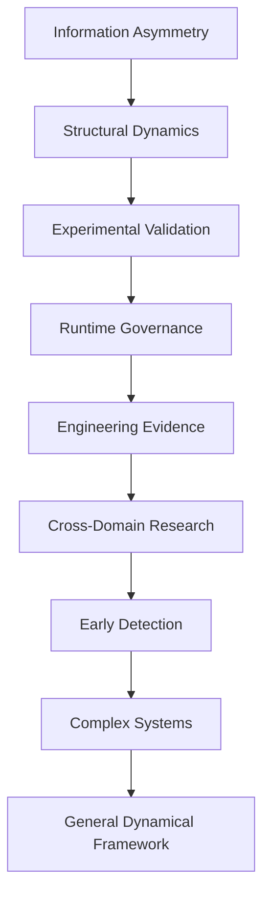
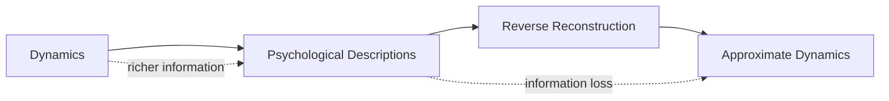
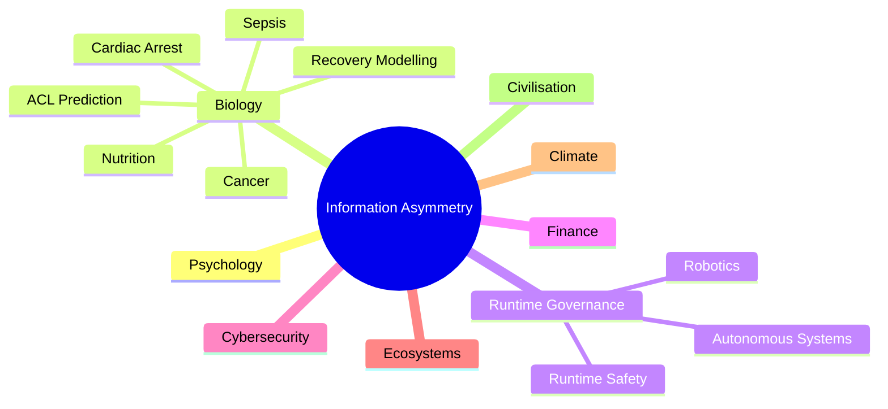

# Information Asymmetry
## Higher-Level Psychological Descriptions as Compressions of Deeper Dynamical Representations
**Davarn Morrison**

> [!NOTE]
> This repository is an early-stage research programme. Runtime Governance is presented as an engineering implementation inspired by the structural framework, not as proof of the scientific hypothesis.

## Repository Navigation

| Section | Purpose |
|---|---|
| `papers/` | Formal academic preprint |
| `diagrams/` | Mermaid diagrams describing the research architecture |
| `mathematics/` | Mathematical notes supporting the hypothesis |
| `experiments/` | Experimental protocols and future validation templates |
| `engineering/` | Runtime Governance implementation notes |
| `future-research/` | Long-term research roadmap |
| `references/` | Bibliography and related work |
| `assets/` | Supporting repository assets |








---

## Overview

Information Asymmetry is an open research programme investigating whether high-level psychological descriptions are compressed projections of deeper dynamical representations.

The project treats psychological terms as potentially useful summaries rather than complete explanations. It asks whether richer structural descriptions — state spaces, trajectories, feedback, constraints, reachability, and transition geometry — can support prediction, explanation, and early detection across complex systems.

The accompanying PDF is the formal academic paper. This repository turns the paper into a living research environment with diagrams, mathematical notes, experiment templates, engineering notes, and future research pathways.

## Core Hypothesis

> **Higher-level psychological descriptions are compressions of deeper dynamical descriptions.**

If this is correct:

> Dynamics should generate psychological descriptions more successfully than psychological descriptions can reconstruct the original dynamics.

Let:

- \(D\) denote a dynamical representation.
- \(P\) denote a psychological description.
- \(f: D \rightarrow P\) denote the forward mapping.
- \(g: P \rightarrow \hat{D}\) denote reverse reconstruction.

The hypothesis predicts:

\[
I(D; \hat{D}) < I(D; D)
\]

where \(\hat{D}\) is the recovered dynamical representation.

## Information Asymmetry

Information asymmetry appears when the forward mapping from dynamics to description preserves enough structure to support prediction, while the reverse mapping from description to dynamics loses information.

| Direction | Question | Expected limitation |
|---|---|---|
| \(f: D \rightarrow P\) | Can dynamics predict psychological labels? | Labels may be coarse but predictable. |
| \(g: P \rightarrow \hat{D}\) | Can labels reconstruct dynamics? | Reconstruction is expected to be partial and underdetermined. |
| \(D \neq \hat{D}\) | Is information lost? | Multiple dynamical histories may map to similar descriptions. |

The scientific aim is to make this asymmetry testable rather than metaphorical.

## Experimental Protocol

| Step | Description |
|---|---|
| 1 | Construct only the dynamical representation |
| 2 | Predict psychological descriptions from dynamics |
| 3 | Discard the original dynamics |
| 4 | Attempt to reconstruct the dynamics from psychological labels |
| 5 | Compare original dynamics with recovered dynamics |
| 6 | Measure information retained and information lost |

The central test is whether psychological descriptions preserve enough information to reconstruct the original dynamical structure.

## Runtime Governance

Runtime Governance is the first engineering implementation inspired by the same structural principles.

- Runtime Governance does not prove the scientific hypothesis.
- It demonstrates that structural representations can be operationally useful in one measurable engineering domain.
- It evaluates trajectories, constraints, reachability, forbidden regions, and execution paths before actions occur.

Runtime Governance provides an engineering environment in which structural representations can be tested through live pre-execution decisions.

## Live Engineering Demonstration

A public implementation of Runtime Governance is available through Resurrection Tech.

| Artefact | Link |
|---|---|
| Website | https://resurrection-tech.com/ |
| Live Demo | https://resurrection-tech.com/live-demo |

- The website and live demo are engineering artefacts.
- They allow readers to observe the Runtime Governance system operating on a live deployment.
- They demonstrate trajectory evaluation before execution and runtime safety decisions.
- They should not be presented as proof of the scientific hypothesis.
- They are evidence that the engineering implementation inspired by the structural framework is operational and publicly testable.

## Engineering Evidence

| Evidence Area | Current Role |
|---|---|
| Live production deployment | Public artefact for observing system behaviour. |
| Deterministic runtime evaluation | Runtime decisions can be specified and inspected. |
| Pre-execution trajectory governance | Proposed actions can be evaluated before execution. |
| Production onboarding | Engineering workflows can be connected to governance logic. |
| Organisational runtime control | Operators can review decisions and evidence. |
| Multi-domain enforcement | Constraints can be adapted across domains. |
| Repeatable engineering behaviour | Future logs and tests can support reproducibility. |

## Research Programme

This repository is organised as a research programme rather than a static paper archive.

| Track | Repository Area | Purpose |
|---|---|---|
| Formal theory | `mathematics/` | Define representations, mappings, losses, and errors. |
| Empirical validation | `experiments/` | Provide reusable protocols for testing the hypothesis. |
| Engineering implementation | `engineering/` | Document Runtime Governance as an operational structural system. |
| Future extensions | `future-research/` | Identify domain extensions without overstating current evidence. |
| Literature | `references/` | Collect references without inventing unsupported citations. |

## Future Research

Future work should focus on testable extensions:

- psychological label prediction from dynamical representations;
- reverse reconstruction limits;
- retained and lost information metrics;
- biological regulation, adaptation, and recovery;
- healthcare-relevant modelling only where evidence and appropriate validation exist;
- autonomous systems, cybersecurity, finance, ecosystems, climate, and infrastructure;
- general dynamical frameworks for early detection in complex systems.

## Repository Structure

```text
information-asymmetry/
│── README.md
│── LICENSE
│── CITATION.cff
│── CONTRIBUTING.md
│── QUICKSTART.md
│── Makefile
│
│── papers/
│     └── README.md
│
│── diagrams/
│     ├── architecture.mmd
│     ├── information-asymmetry.mmd
│     ├── runtime-governance.mmd
│     └── research-roadmap.mmd
│
│── mathematics/
│     ├── README.md
│     ├── state-space.md
│     ├── reachability.md
│     ├── constraint-geometry.md
│     ├── information-theory.md
│     ├── structural-dynamics.md
│     ├── reconstruction-error.md
│     ├── forward-mapping.md
│     └── reverse-mapping.md
│
│── experiments/
│     ├── README.md
│     ├── experiment-template.md
│     ├── psychological-label-prediction.md
│     ├── reverse-reconstruction-test.md
│     └── information-retention-metrics.md
│
│── engineering/
│     ├── README.md
│     ├── runtime-governance.md
│     ├── live-demonstration.md
│     └── engineering-evidence.md
│
│── future-research/
│     ├── README.md
│     ├── roadmap.md
│     ├── biology.md
│     ├── healthcare.md
│     ├── autonomous-systems.md
│     ├── cybersecurity-finance.md
│     ├── ecosystems-climate.md
│     └── civilisation-scale-dynamics.md
│
│── references/
│     ├── README.md
│     └── bibliography.md
│
│── assets/
│     └── README.md
```

> [!NOTE]
> The current publication-ready preprint is available at [`papers/Information_Asymmetry_Preprint.pdf`](papers/Information_Asymmetry_Preprint.pdf) (Version 2.2, 27 pages).

## Citation

Citation metadata is provided in `CITATION.cff`.

Please update the placeholder GitHub URL before public release:

```yaml
url: "https://github.com/YOUR-USERNAME/information-asymmetry"
```

## References

References are maintained in `references/bibliography.md`.

Do not invent citations. Add references only when source material is available and can be verified.
