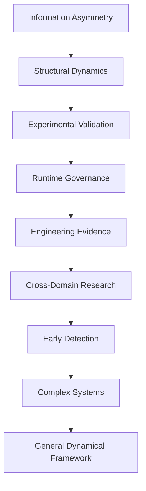
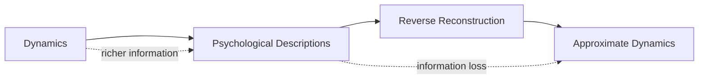
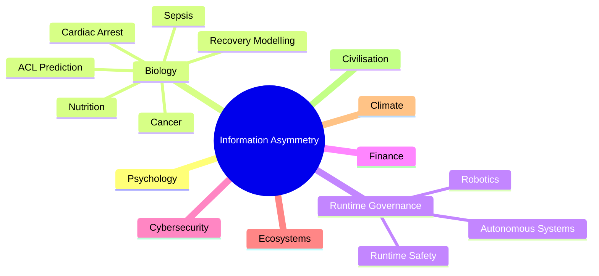

# Information Asymmetry
## Higher-Level Psychological Descriptions as Compressions of Deeper Dynamical Representations
**Davarn Morrison**

> [!NOTE]
> This repository is an early-stage research programme. Runtime Governance is presented as an engineering implementation inspired by the structural framework, not as proof of the scientific hypothesis.

> [!IMPORTANT]
> **Seeking research collaborators, institutional partners, and funding to empirically validate and extend this programme.** See [`FUNDING_AND_COLLABORATION.md`](FUNDING_AND_COLLABORATION.md).

## Repository Navigation

| Section | Purpose |
|---|---|
| [`ABSURDITY_TEST.md`](ABSURDITY_TEST.md) | Practical diagnostic for testing whether psychological language is causally sufficient |
| [`FUNDING_AND_COLLABORATION.md`](FUNDING_AND_COLLABORATION.md) | Research funding, collaboration, institutional support, and empirical validation pathway |
| `papers/` | Formal academic preprint |
| `diagrams/` | Mermaid diagrams describing the research architecture |
| `mathematics/` | Mathematical notes supporting the hypothesis |
| `experiments/` | Experimental protocols and future validation templates |
| `engineering/` | Runtime Governance implementation notes |
| `future-research/` | Long-term research roadmap |
| `references/` | Bibliography and related work |
| `assets/` | Supporting repository assets |


```mermaid
flowchart TD
    A[Information Asymmetry] --> B[Structural Dynamics]
    B --> C[Experimental Validation]
    C --> D[Runtime Governance]
    D --> E[Engineering Evidence]
    E --> F[Cross-Domain Research]
    F --> G[Early Detection]
    G --> H[Complex Systems]
    H --> I[General Dynamical Framework]
```


```mermaid
flowchart LR
    DYN[Dynamics] --> PSY[Psychological Descriptions]
    PSY --> REV[Reverse Reconstruction]
    REV --> APPROX[Approximate Dynamics]
    DYN -. richer information .-> PSY
    PSY -. information loss .-> APPROX
```


```mermaid
flowchart LR
    T[Theory] --> RG[Runtime Governance]
    RG --> EE[Engineering Evidence]
    EE --> FR[Future Research]
```


```mermaid
mindmap
  root((Information Asymmetry))
    Psychology
    Biology
      Nutrition
      Sepsis
      Cancer
      Cardiac Arrest
      ACL Prediction
      Recovery Modelling
    Runtime Governance
      Autonomous Systems
      Robotics
      Runtime Safety
    Finance
    Cybersecurity
    Ecosystems
    Climate
    Civilisation
```

---

## Overview

Information Asymmetry is an open research programme investigating whether high-level psychological descriptions are compressed projections of deeper dynamical representations.

The project treats psychological terms as potentially useful summaries rather than complete explanations. It asks whether richer structural descriptions — state spaces, trajectories, feedback, constraints, reachability, and transition geometry — can support prediction, explanation, and early detection across complex systems.

The accompanying PDF is the formal academic paper. This repository turns the paper into a living research environment with diagrams, mathematical notes, experiment templates, engineering notes, and future research pathways.

## Causal Sufficiency and the Absurdity Test

This project is **not primarily an objection to anthropomorphic language**. Psychological language may be useful as shorthand, interface language, or a coarse-grained behavioural description.

The more important question is:

> **Is the language causally sufficient for the task at hand?**

A description becomes causally insufficient when it omits variables needed to explain why an event occurred, identify where control failed, reconstruct an incident, intervene on the system, assign responsibility, or prevent recurrence.

This distinction is captured by the **Psychological-Language Absurdity Test**:

> **The Absurdity Test does not ask whether psychological language is allowed. It asks whether psychological language is causally sufficient.**

The test applies a psychological explanation to a domain where causal accountability is non-negotiable. If that explanation would be rejected as insufficient for a guided missile, aircraft-control system, nuclear protection system, medical device, railway interlocking system, or other safety-critical mechanism, the same question should be asked when an AI system takes actions with real consequences.

A practical rule is:

> **Apply the psychological explanation to a domain where causal accountability is non-negotiable. If the explanation would be rejected there, ask why it is accepted for AI systems that take actions.**

For example, after a targeting failure, “the missile wanted to hit the building” does not identify the targeting data, sensor state, guidance logic, control law, authorization chain, reachable trajectories, or failure conditions. The sentence may describe the outcome in familiar language, but it is not a sufficient causal reconstruction.

The same standard motivates questions such as:

- What state was the system in?
- What inputs changed that state?
- What capabilities and actions were available?
- What constraints were active or absent?
- Which states were reachable?
- What transition actually occurred?
- Where could the trajectory have been intercepted?
- Which actor or component could have altered the reachable set before the consequence occurred?

See [`ABSURDITY_TEST.md`](ABSURDITY_TEST.md) for the full diagnostic and worked examples.

## Core Hypothesis

> **Higher-level psychological descriptions are compressions of deeper dynamical descriptions.**

If this is correct:

> Dynamics should generate psychological descriptions more successfully than psychological descriptions can reconstruct the original dynamics.

Let:

- \(D\) denote the original dynamical representation.
- \(P\) denote a psychological or behavioural description produced from \(D\).
- \(f: D \rightarrow P\) denote the forward mapping.
- \(g: P \rightarrow \hat{D}\) denote reverse reconstruction.
- \(\hat{D}\) denote the reconstructed dynamical representation.

The research aim is not merely to state that information is lost, but to quantify how much task-relevant information remains recoverable after compression through \(P\).

## Quantifying Information Asymmetry

For a discrete formulation, the residual uncertainty about the original dynamics after reconstruction can be expressed as:

\[
L_{\text{info}} = H(D \mid \hat{D})
\]

Equivalently:

\[
L_{\text{info}} = H(D) - I(D;\hat{D})
\]

where \(H(D)\) is the entropy of the original dynamical representation and \(I(D;\hat{D})\) is the mutual information between the original and reconstructed dynamics.

A stronger comparative test introduces a richer structural representation \(S\) and asks whether it preserves more information about the original dynamics than the psychological description \(P\):

\[
\Delta I = I(D;S) - I(D;P)
\]

The hypothesis predicts \(\Delta I > 0\) for tasks in which the richer structural representation preserves control-relevant variables that the psychological description compresses away.

A related conditional-entropy formulation is:

\[
H(D \mid P) > H(D \mid S)
\]

The important scientific requirement is that these quantities be estimated on held-out data under controlled representation capacity or bit-rate conditions. Otherwise a richer representation may appear superior simply because it contains more unconstrained information.

### Falsification condition

> **If psychological descriptions reconstruct the task-relevant dynamical variables as well as richer structural representations after controlling for representation capacity, then the proposed information asymmetry is not supported for that task.**

This programme therefore treats information asymmetry as an empirical quantity to be estimated, not as an illustrative metaphor.

## Experimental Protocol

The forward/reverse mapping tests should be concrete enough that an independent researcher can run them without needing undocumented assumptions.

| Step | Description |
|---|---|
| 1 | Define the dynamical system \(D\), state variables, trajectories, perturbations, and observation window |
| 2 | Define the psychological or behavioural representation \(P\) and the richer structural comparison representation \(S\) |
| 3 | Specify the forward mapping \(f: D \rightarrow P\), including model class, training data, train/test split, and random seeds |
| 4 | Discard or withhold the original dynamics from the reverse mapper |
| 5 | Specify the reverse mapping \(g: P \rightarrow \hat{D}\) and an equivalent reconstruction path from \(S\) |
| 6 | Reconstruct held-out dynamical variables, trajectories, or transition structure |
| 7 | Measure reconstruction error, predictive performance, mutual information or conditional entropy, and intervention-relevant recovery |
| 8 | Compare against baselines and capacity-matched controls |
| 9 | Report uncertainty, statistical significance or confidence intervals where appropriate, and all random seeds |
| 10 | Apply predeclared failure and falsification criteria |

### Minimum reproducibility requirements

Each protocol in `experiments/` should eventually specify:

- the exact dynamical system or dataset;
- all state variables and observables;
- how psychological labels are produced;
- how richer structural representations are constructed;
- the forward and reverse model classes;
- train/validation/test separation;
- representation-capacity or bit-rate controls;
- baselines and positive controls;
- reconstruction and information-retention metrics;
- perturbation and intervention tests where relevant;
- random seeds and software dependencies;
- expected output files;
- predefined success, failure, and falsification conditions.

The standard is simple: **another researcher should be able to clone the repository, follow the protocol, reproduce the forward/reverse mapping test, and know what outcome would count against the hypothesis.**

## Runtime Governance

Runtime Governance is the first engineering implementation inspired by the same structural principles.

- Runtime Governance does not prove the scientific hypothesis.
- It demonstrates that structural representations can be operationally useful in one measurable engineering domain.
- It evaluates trajectories, constraints, reachability, forbidden regions, and execution paths before actions occur.

Runtime Governance provides an engineering environment in which structural representations can be tested through live pre-execution decisions.

## Live Engineering Demonstration

A public implementation of Runtime Governance is available through Resurrection Tech.

| Artefact | Link |
|---|---|
| Website | https://resurrection-tech.com/ |
| Live Demo | https://resurrection-tech.com/live-demo |

- The website and live demo are engineering artefacts.
- They allow readers to observe the Runtime Governance system operating on a live deployment.
- They demonstrate trajectory evaluation before execution and runtime safety decisions.
- They should not be presented as proof of the scientific hypothesis.
- They are evidence that the engineering implementation inspired by the structural framework is operational and publicly testable.

## Engineering Evidence

| Evidence Area | Current Role |
|---|---|
| Live production deployment | Public artefact for observing system behaviour. |
| Deterministic runtime evaluation | Runtime decisions can be specified and inspected. |
| Pre-execution trajectory governance | Proposed actions can be evaluated before execution. |
| Production onboarding | Engineering workflows can be connected to governance logic. |
| Organisational runtime control | Operators can review decisions and evidence. |
| Multi-domain enforcement | Constraints can be adapted across domains. |
| Repeatable engineering behaviour | Future logs and tests can support reproducibility. |

## Research Programme

This repository is organised as a research programme rather than a static paper archive.

| Track | Repository Area | Purpose |
|---|---|---|
| Formal theory | `mathematics/` | Define representations, mappings, losses, information-theoretic estimands, and falsification criteria. |
| Empirical validation | `experiments/` | Provide reproducible forward/reverse mapping protocols that independent researchers can run. |
| Engineering implementation | `engineering/` | Document Runtime Governance as an operational structural system. |
| Future extensions | `future-research/` | Identify domain extensions without overstating current evidence. |
| Literature | `references/` | Collect references without inventing unsupported citations. |

The programme is currently seeking research collaborators, institutional partners, methodological critique, and funding for empirical validation. See [`FUNDING_AND_COLLABORATION.md`](FUNDING_AND_COLLABORATION.md) for the proposed validation pathway and the forms of support that would be most useful.

## Future Research

Future work should focus on testable extensions:

- reproducible forward/reverse mapping experiments;
- capacity-matched comparisons between psychological and structural representations;
- mutual-information and conditional-entropy estimation on held-out data;
- psychological label prediction from dynamical representations;
- reverse reconstruction limits;
- retained and lost information metrics;
- intervention-sensitive and control-relevant reconstruction tests;
- biological regulation, adaptation, and recovery;
- healthcare-relevant modelling only where evidence and appropriate validation exist;
- autonomous systems, cybersecurity, finance, ecosystems, climate, and infrastructure;
- general dynamical frameworks for early detection in complex systems.

## Repository Structure

```text
information-asymmetry/
│── README.md
│── ABSURDITY_TEST.md
│── FUNDING_AND_COLLABORATION.md
│── LICENSE
│── CITATION.cff
│── CONTRIBUTING.md
│── QUICKSTART.md
│── Makefile
│
│── papers/
│     └── README.md
│
│── diagrams/
│     ├── architecture.mmd
│     ├── information-asymmetry.mmd
│     ├── runtime-governance.mmd
│     └── research-roadmap.mmd
│
│── mathematics/
│     ├── README.md
│     ├── state-space.md
│     ├── reachability.md
│     ├── constraint-geometry.md
│     ├── information-theory.md
│     ├── structural-dynamics.md
│     ├── reconstruction-error.md
│     ├── forward-mapping.md
│     └── reverse-mapping.md
│
│── experiments/
│     ├── README.md
│     ├── experiment-template.md
│     ├── psychological-label-prediction.md
│     ├── reverse-reconstruction-test.md
│     └── information-retention-metrics.md
│
│── engineering/
│     ├── README.md
│     ├── runtime-governance.md
│     ├── live-demonstration.md
│     └── engineering-evidence.md
│
│── future-research/
│     ├── README.md
│     ├── roadmap.md
│     ├── biology.md
│     ├── healthcare.md
│     ├── autonomous-systems.md
│     ├── cybersecurity-finance.md
│     ├── ecosystems-climate.md
│     └── civilisation-scale-dynamics.md
│
│── references/
│     ├── README.md
│     └── bibliography.md
│
│── assets/
│     └── README.md
```

> [!NOTE]
> The current publication-ready preprint is available at [`papers/Information_Asymmetry_Preprint.pdf`](papers/Information_Asymmetry_Preprint.pdf) (Version 2.2, 27 pages).

## Citation

Citation metadata is provided in `CITATION.cff`.

Please update the placeholder GitHub URL before public release:

```yaml
url: "https://github.com/YOUR-USERNAME/information-asymmetry"
```

## References

References are maintained in `references/bibliography.md`.

Do not invent citations. Add references only when source material is available and can be verified.
