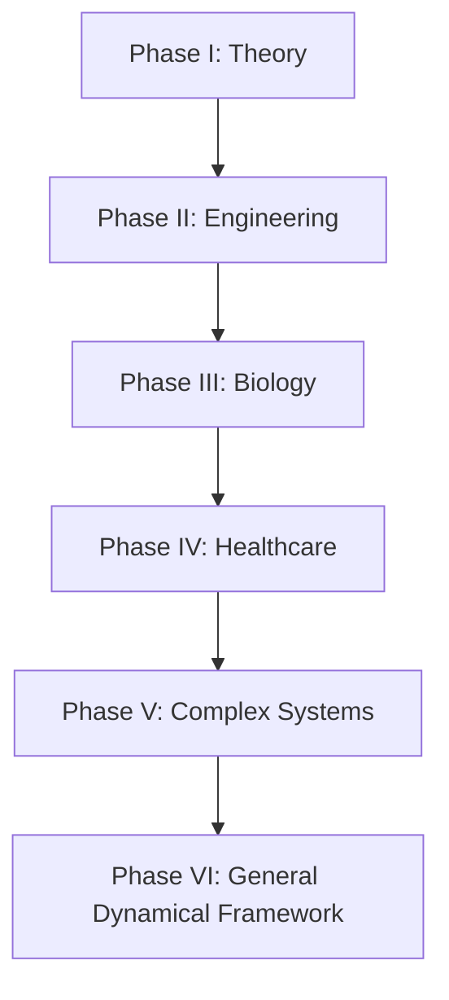

# Research Roadmap

### Phase I — Theory

Formalise the information asymmetry hypothesis.

### Phase II — Engineering

Use autonomous systems and Runtime Governance as measurable engineering environments.

### Phase III — Biology

Explore structural dynamics in biological regulation, nutrition, adaptation, and recovery.

### Phase IV — Healthcare

Explore possible future work in sepsis, cancer, cardiac arrest, ACL injury prediction, recovery modelling, and personalised medicine.

### Phase V — Complex Systems

Explore ecosystems, climate systems, finance, cybersecurity, infrastructure, and societal-scale risk.

### Phase VI — General Dynamical Framework

Investigate whether common dynamical representations can support prediction, explanation, and early detection across increasingly complex systems.
